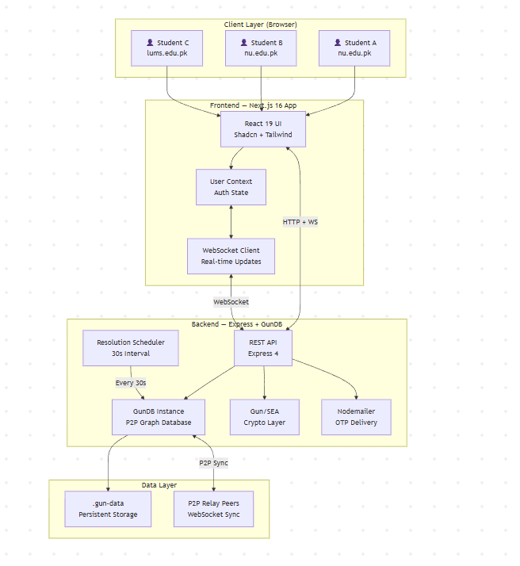
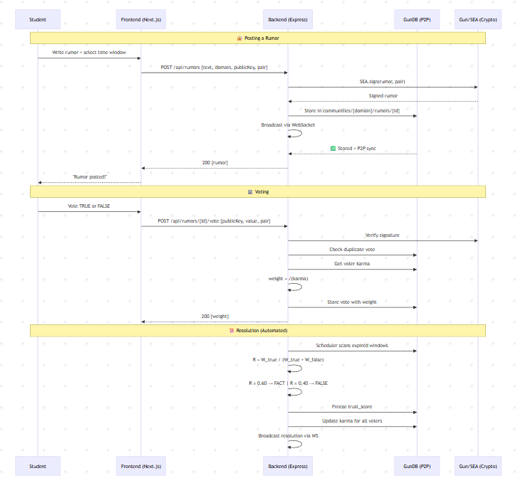
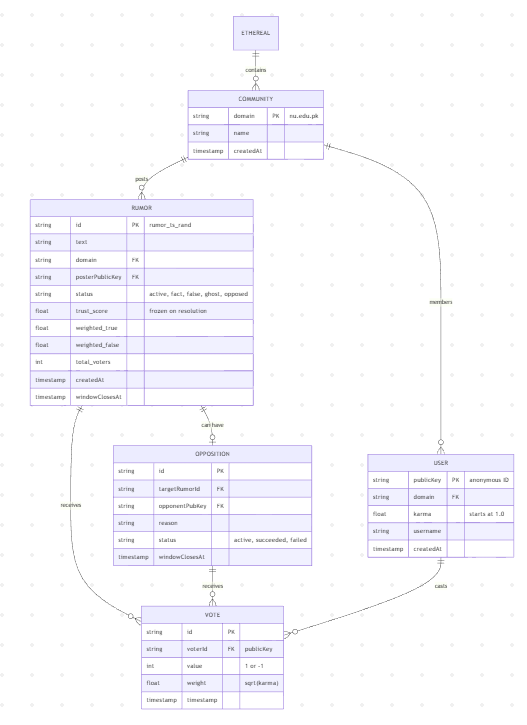
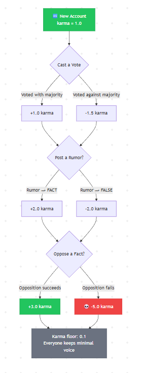

<p align="center">
  
  
  
  
  
  
</p>

<h1 align="center">ETHERIAL</h1>

<p align="center">
  <strong>Decentralized Anonymous Campus Rumor Verification System</strong>
</p>

<p align="center">
  <em>Where truth isn't declared — it's earned.</em>
</p>

<p align="center">
  <a href="https://ethereal-kappa-beige.vercel.app">Live Demo</a> · 
  <a href="#-architecture">Architecture</a> · 
  <a href="#-how-it-works">How It Works</a> · 
  <a href="#-getting-started">Getting Started</a> · 
  <a href="docs/fada-ethereal.md">Full Spec</a>
</p>

---

## 📋 Table of Contents

- [About the Project](#-about-the-project)
- [The Problem](#-the-problem)
- [The Solution](#-the-solution)
- [Architecture](#-architecture)
- [How It Works](#-how-it-works)
- [Tech Stack](#-tech-stack)
- [Project Structure](#-project-structure)
- [Getting Started](#-getting-started)
- [Deployment](#-deployment)
- [Testing](#-testing)
- [Mathematical Proof of Resilience](#-mathematical-proof-of-resilience)
- [Team](#-team)
- [License](#-license)

---

## 🎯 About the Project

**Etherial** was initially built as a solution for **NUST - Olympiad 26** — a university hackathon at NUST challenging teams to build a decentralized, anonymous campus rumor verification platform that can resist manipulation and protect user privacy. Our team **FADA** developed this system to address the problem.

The system enables university communities to **collectively determine truth** through reputation-weighted voting, blind consensus, and cryptographic anonymity — all without a central authority deciding what is "true."

> **No admin. No moderator. No single server decides truth.**  
> A community of real students produces verified facts through math, cryptography, and game theory.

### Deployed Links

| Service | URL | Platform |
|---------|-----|----------|
| **Frontend** | [ethereal-kappa-beige.vercel.app](https://ethereal-kappa-beige.vercel.app) | Vercel |
| **Backend API** | [ethereal-production.up.railway.app](https://ethereal-production.up.railway.app) | Railway |

---

## 🔴 The Problem

Campus communities lack a trustworthy, anonymous platform for sharing and verifying rumors or news:


---

## 💡 The Solution

Etherial addresses every one of these problems through a combination of:

| Problem | Etherial's Solution |
|---------|-------------------|
| **Central Control** | Fully P2P architecture — no server decides truth |
| **Identity Exposure** | Blind authentication — email never stored, only cryptographic keys |
| **Mob Rule** | √(Karma) weighted voting — veterans have 10x power, not 100x |
| **Bot Manipulation** | .edu verification + asymmetric karma penalties |
| **No Accountability** | Losers pay -1.5 karma, winners gain +1.0 (skin in the game) |
| **Stale Truth** | Trust scores frozen on resolution, only Opposition can reopen |
| **Ghost Dependencies** | Soft-delete with cascading recalculation preserves graph integrity |

### Key Innovations

**1. Blind Authentication** — Email + passphrase → deterministic keypair (GunDB SEA). The email is *immediately discarded* after key generation. Same credentials = same identity, every time. No stored passwords, no session tokens.

**2. √(Karma) Weighting** — Vote weight = `√(karma)`. A veteran with 100 karma has 10x the influence of a newbie — not 100x. This prevents reputation oligarchy while still rewarding accurate participation.

**3. Asymmetric Karma Penalties** — Voting correctly earns +1.0, voting incorrectly costs -1.5. This creates real stakes: trolls and bots bleed karma faster than they can accumulate it.

**4. Opposition Challenges** — Even verified FACTs can be contested. But challenging costs -5.0 karma if you lose, ensuring only genuine disputes are raised.

---

## 🏗 Architecture

### High-Level System Architecture



### Data Flow — Posting & Voting on a Rumor



### Rumor Lifecycle State Machine


### GunDB Data Model



### Domain Community Isolation


---

## ⚙ How It Works

### 1. Blind Authentication

```
User enters: email + passphrase
                   ↓
   credHash = SHA-256(username + password)
                   ↓
   keypair = SEA.pair()  →  encrypted & stored by credHash
                   ↓
   Email is DISCARDED — never stored anywhere
                   ↓
   Public key = permanent anonymous identity
```

The same credentials always regenerate the same keypair. No sessions. No cookies. No central auth server.

### 2. √(Karma) Vote Weighting

| User | Raw Karma | Vote Weight (√karma) | Relative Power |
|------|-----------|----------------------|----------------|
| Veteran | 100 | **10.0** | 10× newbie |
| Regular | 25 | **5.0** | 5× newbie |
| Newbie | 1 | **1.0** | Baseline |
| Bot/Troll | 0.1 | **0.316** | Nearly powerless |

Without √: Veteran has **100×** the power (oligarchy).  
With √: Veteran has **10×** the power (influential but not tyrannical).

### 3. Resolution Algorithm

```
When voting window closes:
  1. Collect all votes
  2. Calculate weight per vote: √(voter_karma)
  3. W_true  = Σ weights of TRUE voters
     W_false = Σ weights of FALSE voters
  4. R = W_true / (W_true + W_false)
  5. Quorum check: ≥5 voters AND total_weight ≥ 10
  6. If R ≥ 0.60 → FACT ✅
     If R ≤ 0.40 → FALSE ❌
     If in between → extend window 24h (once), then UNVERIFIED
  7. Freeze trust_score permanently
  8. Apply karma: winners +1.0, losers -1.5, poster ±2.0
```

### 4. Karma Economy



### 5. Opposition System

Only verified FACTs can be opposed. The challenger must have sufficient karma (≥ `max(10, 20% × W_true)`) to prevent frivolous challenges:

- **If opposition succeeds**: Original fact overturned, voters penalized -4.0 each, challenger rewarded +3.0  
- **If opposition fails**: Challenger penalized -5.0 (heavy), original voters rewarded +1.0  
- **A fact can only be opposed once** — prevents harassment through repeated challenges

### 6. Ghost Deletion System

When a rumor is ghosted, it's soft-deleted:

```
Status → "ghost"
Trust score → 0 (nullified)
Votes → nullified
Feed → hidden
Graph node → PRESERVED (referential integrity)
Karma → reversed for all affected voters
Cascade → recalculate all related rumors
```

---

## 🛠 Tech Stack

| Layer | Technology | Purpose |
|-------|-----------|---------|
| **Framework** | Next.js 16 (App Router) | Server-side rendering, routing |
| **UI Library** | React 19 | Component architecture |
| **Component Kit** | Shadcn/ui (Radix Primitives) | Accessible, customizable UI |
| **Styling** | Tailwind CSS 4 | Utility-first CSS, dark theme |
| **Language** | TypeScript 5.7 | Full type safety |
| **Database** | GunDB (P2P) | Decentralized graph database |
| **Cryptography** | Gun/SEA | Keypair generation, signing, encryption |
| **Backend** | Express 4 | REST API + WebSocket server |
| **Real-time** | WebSocket (ws) | Live vote & resolution updates |
| **Email** | Nodemailer | OTP verification |
| **Deployment** | Vercel + Railway | Frontend + Backend hosting |

---

## 📁 Project Structure

```
ethereal/
├── app/                        # Next.js App Router
│   ├── page.tsx                #   Main dashboard (rumor feed, posting, voting)
│   ├── layout.tsx              #   Root layout with providers
│   └── globals.css             #   Global styles & theme
│
├── components/                 # React Components
│   ├── auth-modal-new.tsx      #   Login/register dialog (API-based)
│   ├── community-sidebar-new.tsx #  Domain selector & user stats
│   ├── rumor-card-new.tsx      #   Rumor display, voting, truth meter
│   ├── truth-meter.tsx         #   Visual trust score indicator
│   ├── opposition-modal.tsx    #   Challenge interface
│   ├── theme-provider.tsx      #   Dark/light theme wrapper
│   └── ui/                     #   Shadcn UI primitives (40+ components)
│
├── lib/                        # Core Business Logic
│   ├── api.ts                  #   HTTP client for backend API
│   ├── ws.ts                   #   WebSocket client for real-time
│   ├── user-context-new.tsx    #   Auth state management (React Context)
│   ├── gun-db.ts               #   GunDB instance & database helpers
│   ├── gun-config.ts           #   Relay configuration & communities
│   ├── auth-service.ts         #   Blind authentication (SEA crypto)
│   ├── rumor-engine.ts         #   ⭐ Resolution algorithm (CRITICAL)
│   ├── reputation-logic.ts     #   √(karma) weighting & karma updates
│   ├── opposition-engine.ts    #   Opposition challenges & resolution
│   ├── ghost-system.ts         #   Ghost deletion & cascade
│   ├── resolution-scheduler.ts #   Automated resolution timer
│   ├── timestamp-utils.ts      #   Time window & clock skew handling
│   ├── debug-monitor.ts        #   Development logging
│   └── utils.ts                #   Tailwind class merge utility
│
├── hooks/                      # Custom React Hooks
│   ├── use-mobile.tsx          #   Responsive breakpoint detection
│   └── use-toast.ts            #   Toast notification hook
│
├── server/                     # Express Backend
│   └── index.js                #   API + GunDB + WebSocket + Resolution Engine
│
├── __tests__/                  # All Tests
│   ├── components/             #   Unit tests (Jest + React Testing Library)
│   │   ├── auth-modal.test.tsx
│   │   └── rumor-card.test.tsx
│   └── e2e/                    #   Integration & stress tests
│       ├── functional-scenario-test.js   # Full spec compliance (25 assertions)
│       ├── stress-test.js                # GunDB relay stress test
│       └── test-p2p-sync-script.js       # P2P sync test
│
├── scripts/                    # Utility Scripts
│   ├── relay.js                #   Local GunDB relay server
│   └── kill-dev.ps1            #   Dev server cleanup (Windows)
│
├── docs/                       # Documentation
│   ├── fada-ethereal.md        #   Original hackathon problem spec
│   ├── ARCHITECTURE.md         #   System design & data flows
│   ├── QUICKSTART.md           #   2-minute getting started
│   ├── TESTING.md              #   Test cases & verification
│   ├── TEST_REPORT.md          #   Functional test results (25/25 pass)
│   └── ...                     #   Additional documentation
│
├── types/                      # TypeScript Declarations
│   └── gun.d.ts                #   GunDB type definitions
│
├── public/                     # Static Assets
├── .gun-data/                  # GunDB persistent storage (gitignored)
├── next.config.mjs             # Next.js configuration
├── tailwind.config.ts          # Tailwind theme & design tokens
├── tsconfig.json               # TypeScript configuration
├── jest.config.js              # Jest test configuration
├── railway.json                # Railway deployment config
└── package.json                # Dependencies & scripts
```

---

## 🚀 Getting Started

### Prerequisites

- **Node.js** ≥ 18.0.0
- **npm** (comes with Node.js)

### Installation

```bash
# Clone the repository
git clone https://github.com/mFahadNoor/ethereal.git
cd ethereal

# Install dependencies
npm install --legacy-peer-deps

# Set up environment variables
cp .env.example .env
# Edit .env with your SMTP credentials (or use defaults for local dev)
```

### Running Locally

```bash
# Start both backend API + Next.js frontend
npm run dev

# Backend runs on http://localhost:4000
# Frontend runs on http://localhost:3000
```

### Individual Services

```bash
npm run dev:api     # Backend only (Express + GunDB on port 4000)
npm run dev:next    # Frontend only (Next.js on port 3000)
npm run relay       # GunDB relay server (port 8765)
```

### Try It Out

1. Open [http://localhost:3000](http://localhost:3000)
2. Register with any username and password (e.g., `alice` / `password123`)
3. Enter the OTP sent to your email (or check console in development)
4. Post a rumor → set a voting window → share with your community
5. Open a second browser/incognito tab, register as another user, and vote

---

## ☁ Deployment

### Frontend (Vercel)

The Next.js frontend is deployed on Vercel with automatic deployments from `main` branch.

```bash
# Set environment variable in Vercel dashboard:
NEXT_PUBLIC_API_URL=https://your-backend-url.railway.app
```

### Backend (Railway)

The Express + GunDB backend is deployed on Railway.

```bash
# railway.json is pre-configured:
# Build: npm install --legacy-peer-deps
# Start: node server/index.js
```

### Environment Variables

| Variable | Description | Default |
|----------|-------------|---------|
| `PORT` | Backend server port | `4000` |
| `SMTP_HOST` | Email server host | `smtp.gmail.com` |
| `SMTP_PORT` | Email server port | `587` |
| `SMTP_USER` | Email address for OTP | — |
| `SMTP_PASS` | Email app password | — |
| `NEXT_PUBLIC_API_URL` | Backend URL for frontend | `http://localhost:4000` |
| `NEXT_PUBLIC_FRONTEND_URL` | Frontend URL | `http://localhost:3000` |

---

## 🧪 Testing

### Unit Tests

```bash
npm test                    # Run Jest + React Testing Library tests
```

### Integration / E2E Tests

```bash
# Start the server first
npm run dev

# In another terminal:
npm run test:e2e            # Full functional scenario test (25 assertions)
npm run test:stress         # GunDB relay stress test
npm run test:p2p            # P2P synchronization test
```

### Test Coverage

The functional scenario test suite validates all core spec requirements:

| Test | Assertions | Coverage |
|------|-----------|----------|
| **Blind Auth Determinism** | 4 | Same credentials → same keypair, email never stored |
| **√(Karma) Weighting** | 8 | Weight calculation, resolution formula, quorum check |
| **Opposition Thresholds** | 3 | Karma eligibility, one-per-fact rule |
| **Ghost Cascade** | 10 | Status change, score nullification, feed filtering, child preservation |
| **Total** | **25/25 ✅** | All passing |

See [docs/TEST_REPORT.md](docs/TEST_REPORT.md) for the full test report.

---

## 📐 Mathematical Proof of Resilience

### Sybil Attack Resistance

For an attacker to flip a truthful resolution in a community of `n` honest users (avg karma `k_h`), they need `m` bot accounts:

$$m \geq \frac{T}{1 - T} \times n \times \sqrt{k_h}$$

Where $T = 0.60$ (FACT threshold).

**Example**: Community with 50 honest users, average karma 25:

$$m \geq \frac{0.60}{0.40} \times 50 \times \sqrt{25} = 1.5 \times 50 \times 5 = \textbf{375 verified .edu accounts}$$

An attacker would need **375 unique university email accounts** to flip a single vote. This is practically infeasible.

### Self-Correcting Property

Even if an attack succeeds temporarily:
- Bots that voted for a lie **lose karma** (-1.5 each)
- Honest users who oppose the lie correctly **gain karma** (+3.0 each)
- Over time, attacker influence diminishes while honest influence grows

The system is **self-correcting by design**.

---

## 🔒 Security & Privacy

| Property | Implementation |
|----------|---------------|
| **Email never stored** | Discarded after keypair generation |
| **Deterministic identity** | Same credentials = same keys (no server-side auth) |
| **Signed interactions** | Every rumor, vote, opposition is cryptographically signed |
| **P2P architecture** | No single point of failure or control |
| **Domain isolation** | Karma and voting scoped per university community |
| **Blind voting** | Vote counts hidden during active windows |
| **Karma floor** | Minimum 0.1 — everyone retains minimal voice |

---

## 👥 Team

**Team FADA** built this project for **NUST - Olympiad 26**:

| Name | GitHub |
|------|--------|
| **Dawood Qamar** | [@exeNyx7](https://github.com/exeNyx7) |
| **Fahad Noor** | [@mFahadNoor](https://github.com/mFahadNoor) |
| **Aziq Rauf** | [@aaziy](https://github.com/aaziy) |
| **Abdullah Jamil** | [@abdullahjamil42](https://github.com/abdullahjamil42) |

---

## 📚 Documentation

| Document | Description |
|----------|-------------|
| [fada-ethereal.md](docs/fada-ethereal.md) | Original hackathon problem specification |
| [ARCHITECTURE.md](docs/ARCHITECTURE.md) | System design, data flows, performance |
| [QUICKSTART.md](docs/QUICKSTART.md) | 2-minute getting started guide |
| [TESTING.md](docs/TESTING.md) | Test scenarios & verification checklist |
| [TEST_REPORT.md](docs/TEST_REPORT.md) | Full test report (25/25 passing) |
| [HACKATHON_SUBMISSION.md](docs/HACKATHON_SUBMISSION.md) | Hackathon submission package |
| [JUDGES_QUICK_START.md](docs/JUDGES_QUICK_START.md) | 5-minute judge overview |

---

## 📄 License

This project is open source and available under the [MIT License](LICENSE).

---

<p align="center">
  <strong>Etherial</strong> — Where truth isn't declared. It's earned.
</p>


